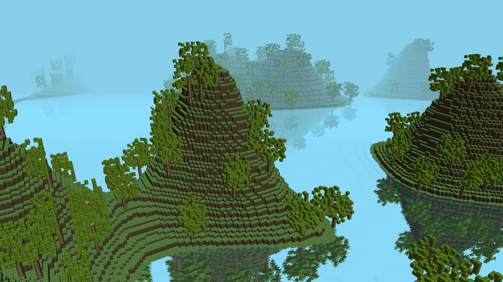

# Voxelworld

Simple tech demo to explore rendering techniques with OpenGL.



## Controls

W                  - Move forward
S                  - Move backward
A                  - Move left
D                  - Move right
Move mouse         - Look around
Left mouse button  - Brick block
Right mouse button - Place block

## Configuration

In the `data` folder you can find a file called `voxelsworld.ini`. Have a look at the 
values and change them to you liking. Set for example `free_fly = 0` to very basic gravity. 

## Requirements

I've only build the app on Linux so far, but Windows should also work as there are 
no platform depended dependencies. 

Make sure you have a recent OpenGL version on your computer. OpenGL 4.6 is needed.
You can check it on a Linux computer with `glxinfo | grep "core profile version"`.

Besides that, you need a C++ compiler that supports C++17, like Clang or GCC. 
CMake and Ninja are also needed for building.

## Build

Open a terminal and clone the project

```sh
git clone https://github.com/FlexW/Voxelsworld
```

Download the dependencies
```sh
cd Voxelsworld
git submodule update --init --recursive
```

And finally, build the project
```sh
cmake --preset=clang_release # You can view a list of presets with cmake --list-presets
ninja -C build/clang_release/
```

## Run

After you followed the above instructions to build the project, you can run it with
```sh
./build/clang_release/src/app
```

## Issues

There will be tons of issues as it is a simple demo to explore rendering rather than 
a solid application. Feel free to report issues [here](https://github.com/FlexW/Voxelsworld/issues).
